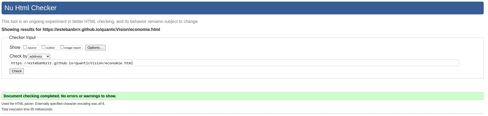
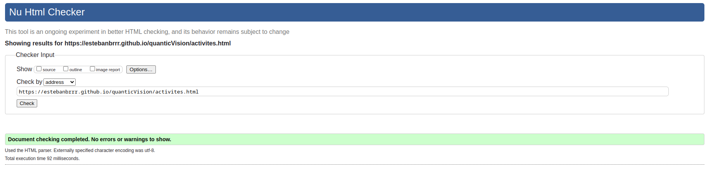
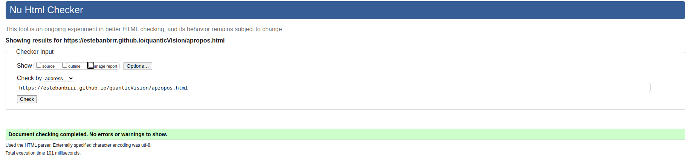
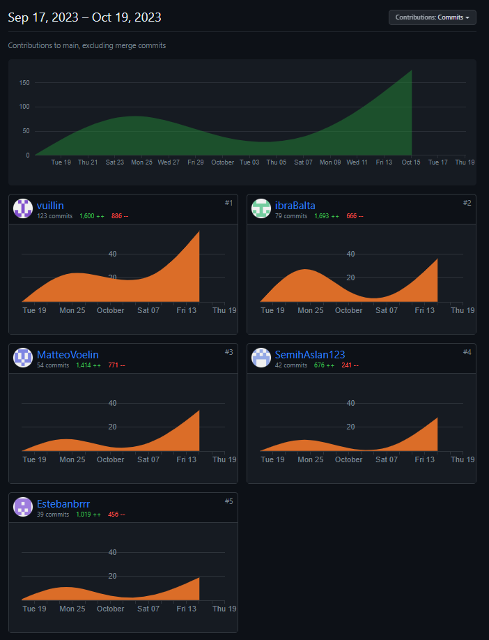

# Quantic Vision   

## Sujet
Site WEB : [Quantic Vision](https://estebanbrrr.github.io/quanticVision/)

## Membres du groupe :

Etudiant 1 (référent du groupe) :  [VUILLIN Thomas](mailto:thomas.vuillin@edu.univ-fcomte.fr?subject=SAE_1_05_06)  
Etudiant 2 : [BALTA Ibrahim](mailto:ibrahim.balta@edu.univ-fcomte.fr?subject=SAE_1_05_06)   
Etudiant 3 : [ASLAN Semih](mailto:thomas.vuillin@edu.univ-fcomte.fr?subject=SAE_1_05_06)  
Etudiant 4 : [VOELIN Matteo](mailto:semih.aslan@edu.univ-fcomte.fr?subject=SAE_1_05_06)  
Etudiant 5 : [BARTHOD-MALAT Esteban](mailto:esteban.barthod-malat@edu.univ-fcomte.fr?subject=SAE_1_05_06) 

# Présentation du projet

Ce dépôt correspond à un site web créé en HTML/CSS/JS dans le cadre de la SAÉ S1. 05-06 de l'IUT de Belfort-Montbéliard. Le projet prend la forme d'un site informatif concernant l'entreprise française Quantic Dream. Notre site sert de vitrine pour présenter les produits de l'entreprise, son organisation, son fonctionnement économique ainisi que son historique. Vous trouverez dans ce dépôt et sur le site un rapport économique analysant l'aspect économique de Quantic Dream.

## Choix de la conception 

Pour la conception du site, nous nous sommes inspirés de plusieurs templates comme celui d'[Aquavist](https://templatekit.jegtheme.com/aquavist/?storefront=envato-elements), ou encore celui d'[Inspiro Lite](https://demo.wpzoom.com/inspiro-lite/). Nous avons aussi pris comme référence, une charte graphique créé par nos soins et téléchargeable [ici](doc/style_tiles.pdf).

## Développement Site Web et Validation des pages

### Page d'accueil

**Auteur : VUILLIN Thomas**  

Vérification W3C :

### Page des produits

**Auteur : BALTA Ibrahim**  

Vérification W3C : [Détail ICI](https://validator.w3.org/nu/?doc=https%3A%2F%2Festebanbrrr.github.io%2FquanticVision%2Fproduits.html)

### Page économie

**Auteur : ASLAN Semih**  

Vérification W3C : [Détail ICI](https://validator.w3.org/nu/?doc=https%3A%2F%2Festebanbrrr.github.io%2FquanticVision%2Feconomie.html)

### Page écologie

**Auteurs : BALTA Ibrahim et VUILLIN Thomas**  

Vérification W3C : [Détail ICI](https://validator.w3.org/nu/?doc=https%3A%2F%2Festebanbrrr.github.io%2FquanticVision%2Fecologie.html)

### Page activités

**Auteurs : VOELIN Matteo**  

Vérification W3C : [Détail ICI](https://validator.w3.org/nu/?doc=https%3A%2F%2Festebanbrrr.github.io%2FquanticVision%2Factivites.html)

### Page "à propos"

**Auteurs : BARTHOD-MALAT Esteban**  

Vérification W3C : [Détail ICI](https://validator.w3.org/nu/?doc=https%3A%2F%2Festebanbrrr.github.io%2FquanticVision%2Fapropos.html)

## Répartition du travail :

### Planification - Diagramme de GANTT

- VUILLIN Thomas
- BALTA Ibrahim

 
### Recherches d'informations - Fiche informative entreprise

- VUILLIN Thomas

### Rapport économique

- ASLAN Semih
- VUILLIN Thomas
- BALTA Ibrahim 
- VOELIN Matteo
- BARTHOD-MALAT Esteban

### Zoning - Wireframe

- VOELIN Matteo
- BALTA Ibrahim
- BARTHOD-MALAT Esteban

### Templates

- ASLAN Semih

### Style tiles

- VUILLIN Thomas

### Mise en place du Gitlab / Bitbucket

- ASLAN Semih

### Développement site

Footer : VUILLIN Thomas  
Navbar : BALTA Ibrahim

### Contributeurs

